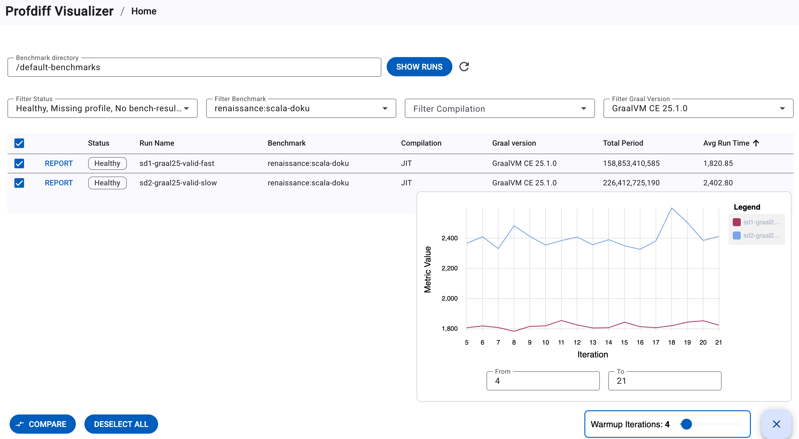
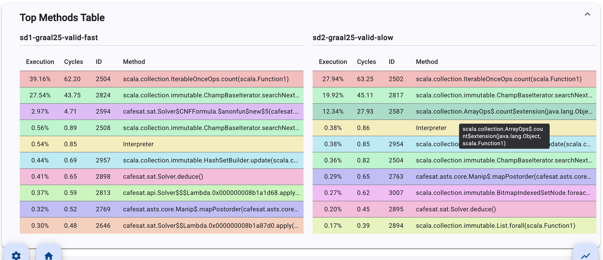
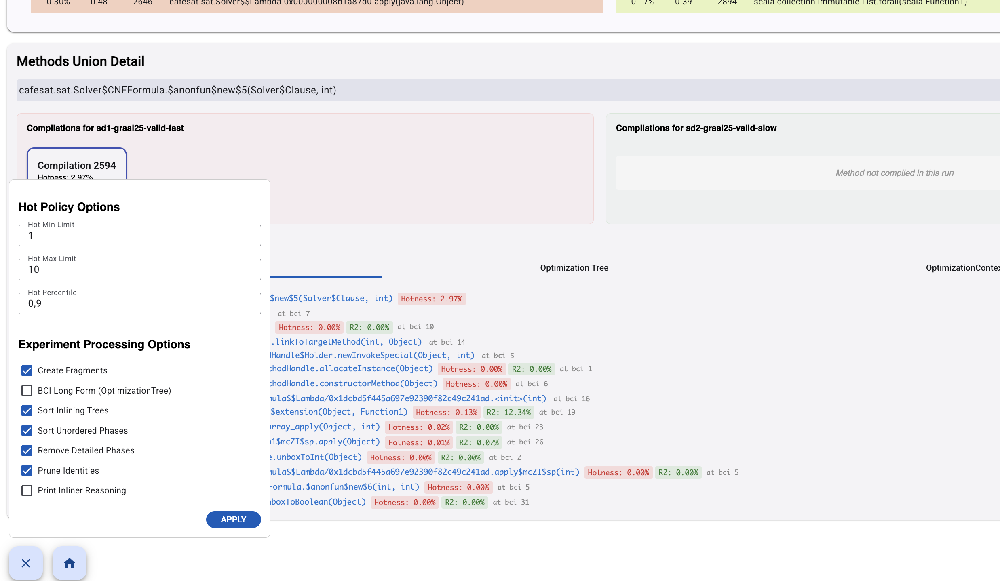
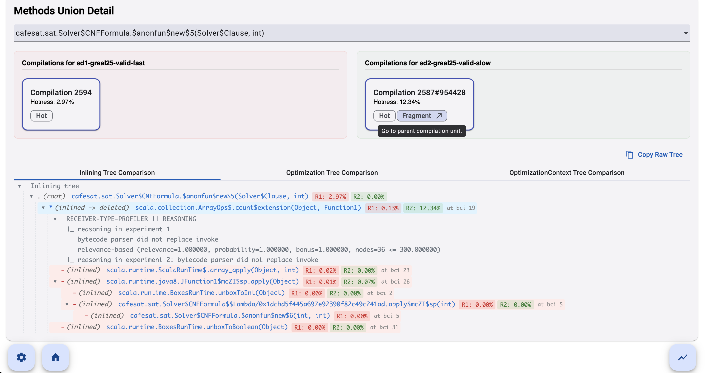
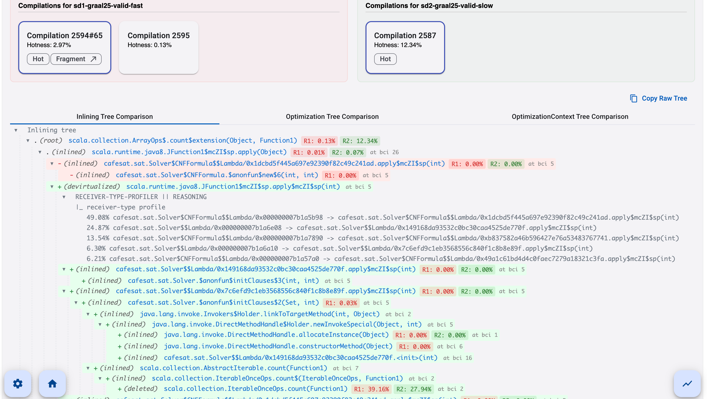

# User documentation
This documentation describes how to use the Profdiff Visualizer to investigate performance regressions. Rather than explaining every GUI element, the guide follows a concrete investigation of a real regression in the `renaissance:scala-doku` benchmark suite. The data for this walkthrough is included in the visualizer's demo benchmarks directory, allowing the reader to reproduce each step interactively.

## Setup

The Profdiff Visualizer ships as a Docker image. After cloning the repository, start the client-server application with `docker compose up ----build`. Then set the `BENCHMARK_DIR` environment variable (or add it to the `.env` file within the repository root) to point to the directory designated for your benchmark runs. The specified mounted directory through the `BENCHMARK_DIR` environment variable is located under `/workspace` inside the container. Also, a set of demo runs is always available under `/default-benchmarks` inside the container.

## Discovering benchmark runs

Open the application in a browser (by default running on `localhost:4200`, but the port can be changed by setting the `FRONTEND_PORT` environment variable in `.env` file). The landing page is the `Home` view.

Type `/default-benchmarks` into the *Benchmark directory* input field and click the *Show Runs* button next to the input. A refresh icon next to this button can be used to clear the cached directory state if new benchmark runs are added to the mounted directory.

The table is populated with all benchmark runs found under the path. Each row displays the run name, the benchmark name, and other metadata such as the average per-iteration time (parsed from the `bench-results.json` and profile data files). Each row also features a *REPORT* button, which provides a fast redirect to a single-run analysis view. If the application detects an error, a red warning container will appear instead of the table; the orange warning container below the table signals recoverable errors, such as an empty run directory within the benchmarks root path. Clicking any table header sorts the table by that column.

Four dropdowns above the table let you filter the table by status, benchmark name, compilation kind, and GraalVM version. For this investigation, check `renaissence:scala-doku` in the *Filter Benchmark* and the `GraalVM CE 25.1.0` in the *Filter Graal Version*. Only two runs, `sd1-graal25-valid-fast` and `sd2-graal25-valid-slow`, remain in the table.

Select both runs by clicking the checkbox in the first column of each row. The chart icon in the bottom-right is enabled, and by clicking the icon, a line chart appears, showing per-iteration run times for both benchmark runs. The stable gap between the two lines confirms a regression rather than a warm-up noise. The *Warmup Iteration* slider in the bottom-right excludes early iterations from the average displayed in the table.

## Regression investigation

With both rows selected, click the *Compare* button in the bottom-left. The `Compare` view places two runs side-by-side across three sections: general metadata, the top-methods table, and the methods union detail. The first selected run appears on the left, and the second selected run appears on the right.

The top-methods table, if profiler data are available, lists the most frequently executed compilation units sorted by the greatest share in execution time. Hovering over any row highlights the corresponding compilation unit in the opposite run.

Scanning the two tables immediately reveals the key asymmetry. In the fast run, the compilation unit of the `Solver\$CNFFormula.\$anonfun\$new\$5` method accounts for 2.97% of execution time, but in the slow run this method's compilation is missing entirely. Instead, the compilation unit for the method `ArrayOps\$.count\$extension` occupies this position, with an execution time of 12.34%. Clicking on compilation unit `2594` in the fast top-methods table jumps directly to the *Methods Union Detail* section, which automatically selects that compilation unit.

The *Methods Union Detail* section contains a dropdown of sorted compiled methods, the compilation units for the selected compiled method, and three distinct tabs (the *Inlining Tree*, the *Optimization Tree*, and the *Optimization-Context Tree*) for the selected compilation pair to explore compiler decisions. When exploring these trees, color coding helps to identify differences. The red nodes correspond to the left run and the green nodes to the right run (as the background of compilation units hints, also the tooltip when hovering over node symbols makes it clear).

In the current investigation, the compilation cards panel shows the compilation unit `2594` for the fast run, but the text *"Method not compiled in this run"* on the slow side. This is unusual. A method that consumes nearly 3% of the execution time in one run is not compiled as a standalone unit in the other. That leads to the idea, that the method was inlined into the parent compilation unit in the slow run and therefore never compiled independently. Because the parental method was not marked hot under the default thresholds, no compilation fragment was extracted for it either.

To verify this hypothesis, open the settings panel by clicking the gear icon in the bottom-left, increase the *Hot Min Limit* to 3, confirm that *Create Fragments* is checked, and click *Apply*. A new compilation card, `2587#954422` labeled with a *Fragment* clickable chip, now appears on the slow side. Hovering over the compilation identifier reveals a tooltip naming the parent compilation unit in which this method's code was inlined: `ArrayOps\$.count\$extension`.

Clicking the *Fragment* chip (or in this case the blue node in *Inlining tree*) navigates you to the parental compilation unit where the investigation of regression becomes clear. In the fast run JIT inlined `ArrayOps\$.count\$extension` into `Solver\$CNFFormula.\$anonfun\$new\$5`, producing a single compact compilation unit. Instead of inlining, devirtualization was used, so the compilation unit of `ArrayOps\$.count\$extension` became a large standalone unit that must handle calls from multiple callers.

